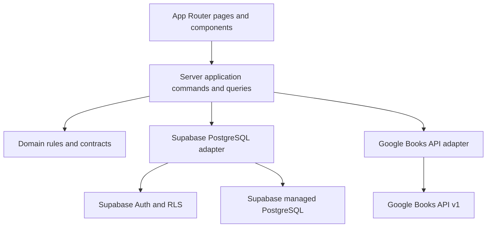
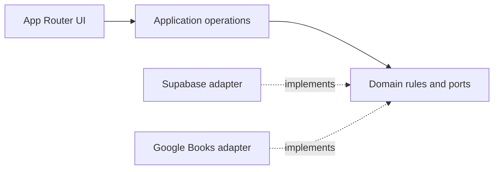
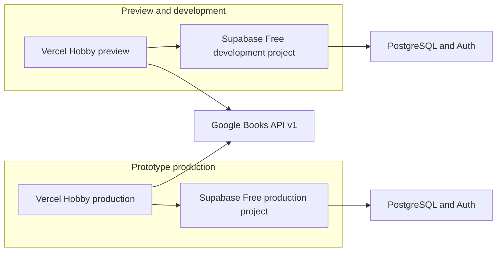

# Architecture Spine — Letterboxd de Livros

## Design Paradigm

Use a **modular monolith**: one Next.js App Router application, organized as presentation (`src/app`), server-side application commands/queries (`src/server`), domain rules and ports (`src/domain`), and adapters (`src/infrastructure`). Compile-time dependencies point inward: UI depends on application operations; application operations depend on domain rules and ports; adapters implement those ports. The runtime call flow is shown below. Do not add a separate API service, microservices, job queue, or ORM for this MVP.



Compile-time dependencies (arrows point from dependent code to the contract it imports):



## Invariants & Rules

### AD-1 — One modular full-stack application

- **Binds:** CAP-1 through CAP-6
- **Prevents:** Independently built pages inventing different backends, data access paths, or ownership of business rules.
- **Rule:** Keep UI and route handlers in the Next.js App Router; put use-case orchestration in server-only application modules and reusable invariants in domain modules. Infrastructure adapters implement those operations. Browser code must not write application tables directly. Do not deploy a second application service for the MVP.

### AD-2 — PostgreSQL owns application state

- **Binds:** CAP-2, CAP-3, CAP-4, CAP-5
- **Prevents:** Divergent review/status copies, duplicate books, and partially applied user actions.
- **Rule:** Supabase PostgreSQL is canonical for app-owned books, profiles, reviews, shelf entries, and vibes; Supabase Auth is the identity source. Resolve a book detail route by local UUID or Google `externalId`; when not yet local, read detail from Google Books without persisting it. Atomically upsert by unique `externalId` on the first shelf, review, or vibe write; map Google volume `id` to `externalId`; thereafter app-owned data uses the local Book UUID. A shelf-only add creates a new Shelf row with `Quero ler`; repeating the add is idempotent and preserves the existing status. A review submission requires an explicit status and applies it to that same row. Enforce at most one `Shelf` and one active `Review` per `(userId, bookId)`; update a review in place and delete it when its author removes it while preserving any existing Shelf row/status. Shelf-entry removal is outside MVP; users change status rather than delete the entry. One `SECURITY INVOKER` database transaction/RPC owns first-use book upsert plus review/shelf/vibe changes and runs under the caller's verified identity and RLS. The status exists only in `Shelf` and is shared by evaluation and shelf views.

### AD-3 — Database constraints define shared data shape

- **Binds:** CAP-2, CAP-3, CAP-4, CAP-5
- **Prevents:** Incompatible identifiers, invalid ratings/statuses, duplicate user-book state, and app-specific secrets leaking into profile data.
- **Rule:** Use UUIDs for app primary keys and the Supabase Auth user ID for the profile ID; store the Google volume ID as unique, non-null text `externalId`. Store ratings as unconstrained PostgreSQL `NUMERIC NOT NULL`; reject values outside 1.0–5.0 or not in half-star increments before storage, and enforce `NOT NULL`, range, and `rating * 2 = trunc(rating * 2)` in the database so invalid precision is never silently rounded. The API accepts integer half-star units 2–10 and converts them to exact numeric values. Store timestamps as `timestamptz`; constrain shelf status to `Quero ler`, `Lendo`, `Lido`, or `Abandonei`. Store vibes as non-empty canonical text; a database check requires `vibe = lower(trim(vibe))`, and uniqueness is per user/book/canonical-vibe; render each canonical value once per book. The profile row uses the Auth UUID, required `name`, and optional `profileImageUrl`; email/password credentials remain exclusively in Supabase Auth. Book rows use required `title` and display-form `author`, optional `coverUrl`, `genre`, and `description`; first adoption stores a metadata snapshot and subsequent searches do not overwrite it. Review rows require user/book IDs, rating, non-empty text, `createdAt`, and `updatedAt`; `createdAt` never changes on edit, `updatedAt` advances on each edit, and recent-review feeds order by `createdAt DESC, id DESC`. Shelf rows require user/book IDs, status, and `updatedAt`, which advances on every status transition. Version schema changes as SQL migrations.

### AD-4 — Aggregate ratings are derived from app reviews

- **Binds:** CAP-1, CAP-2, CAP-5
- **Prevents:** Stale cached averages and mixing Google ratings with this product's community ratings.
- **Rule:** Require one non-null rating on every active review. Compute book and user averages as PostgreSQL `AVG(Review.rating)` from committed app reviews when read; do not store a separate average or import Google Books ratings into them. Return numeric values at database precision and round only for display to two decimal places through one shared formatter. Review creation, edit, and deletion affect the next committed read without a background refresh job. Deleting a review preserves the user's independent Shelf row/status.

### AD-5 — Google Books is the sole catalog search authority

- **Binds:** CAP-1
- **Prevents:** Local catalog growth, different result ordering, and provider-policy violations.
- **Rule:** Search titles/authors through a server-side Next.js Route Handler calling Google Books API v1 with `intitle:`/`inauthor:` queries, `maxResults=20`, and zero-based `page` (`startIndex = page * 20`); show a next-page control only when provider `totalItems > startIndex + returnedItems`. Keep the API key server-only and restrict it to the Books API. Do not create a local title/author text index or reorder, alter, or intermix provider search results. Show each result's cover, title, author, app rating average when available, required Google attribution adjacent to search/results, and a prominent Google Books link. Map every provider volume through one adapter: provider `id` → `externalId`; title → `title`; ordered authors joined by `, ` → `author`; first category → `genre`; `imageLinks.thumbnail` then `smallThumbnail` → `coverUrl`; description → `description`. Use null for unavailable optional fields and `Autor desconhecido` if Google supplies no author. Use the same mapping for search-result adoption and detail-page adoption. Resolve detail routes first by local UUID, then by provider `externalId`; provider detail reads do not force local persistence. The homepage may order locally reviewed books by app activity/rating but must not alter a Google Books result set.

### AD-6 — Database authorization is the security boundary

- **Binds:** CAP-2 through CAP-6
- **Prevents:** A client bypassing page-level checks to read private shelves or mutate another user's data.
- **Rule:** Use request-scoped Supabase SSR clients and verified auth claims on the server. Every exposed table has least-privilege grants and RLS policies, tested for allowed and denied operations. Owners can read all their Shelf rows/statuses; other users' Shelf rows are never exposed directly. Public recent reads use a restricted projection containing only profile ID, book ID, and Shelf `updatedAt`, filtered to `Lido`, ordered by `updatedAt DESC, id DESC`; `updatedAt` is the last status-change time and changes on every status transition. Public reads also allow book pages, reviews, vibes, and profile name/photo; if `profileImageUrl` is absent, render an avatar from the user's initials. Review/vibe writes and all private mutations require ownership. The transaction RPC is `SECURITY INVOKER`, executable only by the authenticated role, and covered by RLS policy tests. Expose recent reads only through an RLS-respecting view/query that returns no other Shelf columns. Never expose a Supabase service-role secret to browser code or trust UI checks as authorization.

## Consistency Conventions

| Concern | Convention |
| --- | --- |
| Identity and IDs | Supabase Auth UUID owns the profile; app entities use UUID primary keys; provider IDs remain opaque text. |
| Review and shelf writes | Server actions call the shared server-only use case; database constraints/RLS are authoritative; the combined book/review/shelf change is transactional. |
| Rating and averages | API sends integer half-star units 2–10; database stores exact half-star numeric values; book/user averages derive from app reviews and display through one two-decimal formatter. |
| Time | Persist event timestamps as `timestamptz`; serialize at the API boundary as ISO 8601. |
| Metadata and deletion | Adopted book metadata is a first-use snapshot; provider search never overwrites it. Deleting a review preserves the independent shelf status. |
| Public profile projection | Other users see only `Lido` book IDs and completion timestamps as recent reads; owners can read all their statuses. |
| Errors and secrets | Return a stable user-safe error from server operations; log technical detail server-side without credentials. Keep Google API key and Supabase service credentials server-only. |
| Migrations and environments | Commit SQL migrations; deploy preview/development and production to separate Supabase Free projects, with independent Auth users and data. |

## Stack

| Name | Version / selected plan |
| --- | --- |
| Next.js App Router | 16.3.6 (official installation docs, 2026-07-21) |
| Node.js | 20.9 minimum (Next.js requirement) |
| TypeScript | Enabled by the official Next.js recommended starter |
| Supabase | Free plan for preview/development and disposable personal prototype; managed Auth and PostgreSQL |
| Vercel | Hobby plan for personal, non-commercial prototype deployments |
| Google Books API | v1, public-volume search |

The official Next.js installation page verifies the version and Node minimum above. Re-check the live starter and provider terms when bootstrapping; lock concrete npm package versions in the generated lockfile rather than copying unverified SDK versions into this spine.

## Structural Seed



```text
src/
  app/                 # App Router pages, Server Actions, and Google Books Route Handler
  domain/              # Product invariants and shared types
  server/              # Use cases and server-only orchestration
  infrastructure/      # Supabase and Google Books adapters
supabase/
  migrations/          # Versioned schema, constraints, RLS, and transaction functions
```

Supabase Free currently lists two active projects, 500 MB database per project, and automatic pausing after one week of inactivity. Vercel Hobby is $0 for personal, non-commercial use. Google Books terms prohibit charging users a fee for the API application without a separate agreement or written permission. This deployment seed is therefore limited to a non-commercial prototype; do not enable monetization on this stack without re-evaluating both providers' terms.

## Capability → Architecture Map

| Capability / Area | Lives in | Governed by |
| --- | --- | --- |
| CAP-1 discovery/search | App Router pages; server-side Google Books adapter; local app queries for reviews | AD-1, AD-2, AD-5 |
| CAP-2 rating/review/status | Server application operation; transactional PostgreSQL function | AD-2, AD-3, AD-4, AD-6 |
| CAP-3 personal shelf | Server application operation; `Shelf` rows | AD-2, AD-3, AD-6 |
| CAP-4 vibes | Book page and `BookVibe` rows | AD-2, AD-3, AD-6 |
| CAP-5 profile | Public-safe profile/review reads, count of own `Lido` Shelf rows, average of own active Review ratings, and `Lido`-only recent-read projection | AD-2, AD-3, AD-4, AD-6 |
| CAP-6 email/password access | `/login` and `/cadastro` routes backed by Supabase Auth email/password; no social providers | AD-1, AD-6 |

Index invariants: unique indexes enforce Book `externalId`, Shelf `(userId, bookId)`, Review `(userId, bookId)`, and BookVibe `(userId, bookId, vibe)`. Add B-tree indexes on Review `(bookId, createdAt DESC)` and `(userId, createdAt DESC)`, Shelf `(userId, status, updatedAt DESC)` and `(status, updatedAt DESC)` for the public `Lido` projection, plus BookVibe `bookId`. These support required page feeds and RLS filters; no title/author text index exists in the MVP.

### Route contract

| Route | Required architecture behavior |
| --- | --- |
| `/` | Show popular or recently rated books with cover, title, author, and app rating average; show recent reviews and a search entry point. Local ordering applies only to local app data. |
| `/buscar` | Search by title or author through Google Books; preserve provider order and use stable 20-result pagination. |
| `/livro/:id` | Resolve local UUID or provider `externalId`; show cover, title, author, genre, synopsis, app rating average/count, reviews, vibe tags, review/status actions, and add-to-shelf action. |
| `/estante` | Group every status row belonging to the authenticated owner by the four statuses; show cover and basic book information. |
| `/perfil/:id` | Show public name/photo, count of `Lido` rows, the user's active-review average, recent `Lido` books, and public reviews. |
| `/login`, `/cadastro` | Use Supabase Auth email/password only; no social login. |

Users select extensible vibes and see each distinct value once as a tag on the book page. Preserve the product's own visual identity: covers are the primary visual, with book cards, rounded edges, comfortable spacing, modern typography, clean navigation, and film-review platforms only as inspiration, never copied directly. Keep the find → review → shelf flow to few steps. Out of scope remains chat/private messages, followers, complex social features, manual book entry, social login, file uploads, and unlisted features.

## Deferred

- Revisit hosting and Google Books API terms before any commercial use, fee, or production availability commitment; Vercel Hobby is personal/non-commercial and Google Books terms restrict charging without agreement or written permission.
- Select provider-supported PostgreSQL major version and exact SDK versions when creating projects and bootstrapping the starter; development and production must use the same PostgreSQL major. Keep the package lockfile and migrations as implementation truth.
- Add local title/author indexes only if Google Books quota, latency, or a changed product requirement makes provider search insufficient; then reassess result-combination and attribution rules.
- Set production email delivery/password recovery configuration, API quotas/rate limits, backup/restore objectives, custom domain, and monitoring before inviting real users. Supabase Free pauses inactive projects and does not include automatic backups.
- Add historical review versioning only if an audit/history requirement appears; the MVP keeps one editable active review per user/book.
- Align `data-model.md` with the adopted identity boundary before implementation: its proposed `User.email` and `User.passwordHash` conflict with this spine's Supabase Auth ownership; keep credentials in Auth and restrict the app profile row to its Auth UUID, display name, and optional image URL.
